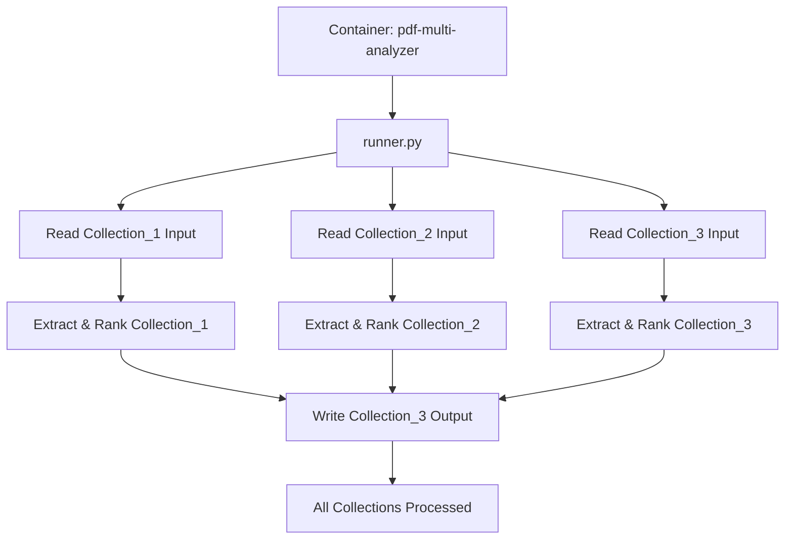

# Adobe-India-Hackathon25-1b
[](https://www.docker.com/) [](LICENSE) [](sample_dataset/schema/output_schema.json)

 Overview: Advanced PDF analysis solution that processes multiple document collections and extracts relevant content based on specific personas and use cases. Multi-Collection PDF Analysis

## Project Structure
```

Challenge\_1b/
├── Collection\_1/                    # Travel Planning
│   ├── PDFs/                        # South of France guides
│   ├── challenge1b\_input.json      # Input configuration
│   └── challenge1b\_output.json     # Analysis results
├── Collection\_2/                    # Adobe Acrobat Learning
│   ├── PDFs/                        # Acrobat tutorials
│   ├── challenge1b\_input.json      # Input configuration
│   └── challenge1b\_output.json     # Analysis results
├── Collection\_3/                    # Recipe Collection
│   ├── PDFs/                        # Cooking guides
│   ├── challenge1b\_input.json      # Input configuration
│   └── challenge1b\_output.json     # Analysis results
└── README.md                        # This file

````




---

## Collections

### Collection 1: Travel Planning
- **Challenge ID**: round_1b_002  
- **Persona**: Travel Planner  
- **Task**: Plan a 4-day trip for 10 college friends to South of France  
- **Documents**: 7 travel guides  

### Collection 2: Adobe Acrobat Learning
- **Challenge ID**: round_1b_003  
- **Persona**: HR Professional  
- **Task**: Create and manage fillable forms for onboarding and compliance  
- **Documents**: 15 Acrobat guides  

### Collection 3: Recipe Collection
- **Challenge ID**: round_1b_001  
- **Persona**: Food Contractor  
- **Task**: Prepare vegetarian buffet-style dinner menu for corporate gathering  
- **Documents**: 9 cooking guides  

---

## Input/Output Format

### Input JSON Structure
```json
{
  "challenge_info": {
    "challenge_id": "round_1b_XXX",
    "test_case_name": "specific_test_case"
  },
  "documents": [
    {
      "filename": "doc.pdf",
      "title": "Title"
    }
  ],
  "persona": {
    "role": "User Persona"
  },
  "job_to_be_done": {
    "task": "Use case description"
  }
}
```

### Output JSON Structure
 ```json
{
  "metadata": {
    "input_documents": ["list"],
    "persona": "User Persona",
    "job_to_be_done": "Task description"
  },
  "extracted_sections": [
    {
      "document": "source.pdf",
      "section_title": "Title",
      "importance_rank": 1,
      "page_number": 1
    }
  ],
  "subsection_analysis": [
    {
      "document": "source.pdf",
      "refined_text": "Content",
      "page_number": 1
    }
  ]
}
```


## Key Features

* Persona-based content analysis
* Importance ranking of extracted sections
* Multi-collection document processing
* Structured JSON output with metadata

## License
This project is licensed under the MIT License. See [LICENSE](LICENSE) for details.
